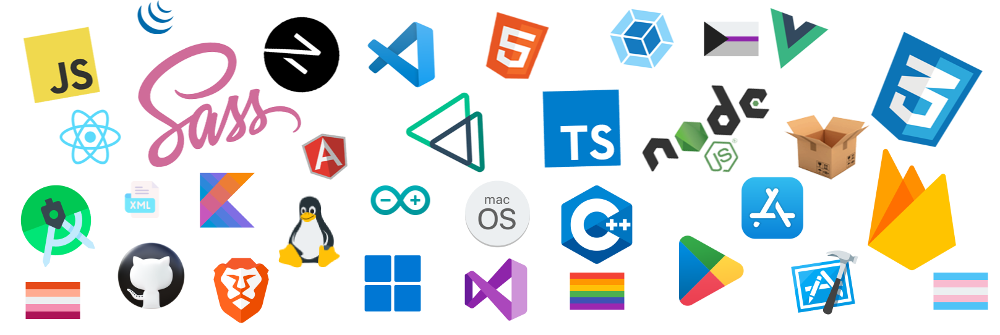

 [](https://wakatime.com/@0d79fbd8-f580-4eea-a144-895437e093b4)
 
<p align="center">
  
</p>

<h3 align="center">Hi there, I'm la niina</h3>

<p align="center">
  <samp>Transgender Gay Woman 🏳️‍⚧️🏳️‍🌈🇺🇬 | Software Developer | Full Stack Developer</samp>
  <br>
 <samp>LGBTQIA+ Activist, advocate for software skills, and human rights activist</samp>
 <br>
 <br>
 <samp><a href="https://gofund.me/d228af80">GoFundMe</a></samp>
</p>

<br>

```java
class Person {
  constructor() {
    this.name = "la niina";
    this.traits = ["FULL STACK", "DEV"];
    this.age = new Date().getFullYear() - 2014;
  }
}
```

# Languages and Frameworks
</bold><br/>
<br/>
<code></code>
<code></code>
<code></code>
<code></code>
<code></code>
<code></code>
<code></code>
<code></code>
<code></code>
<code></code>
<code></code>
<code></code>    
<br/>
<br/>

# 📈 my github stats

[](https://shields.io/)       


<br/>

# Used programming langauages

[](https://github.com/anuraghazra/github-readme-stats)

<!--[](https://github.com/anuraghazra/github-readme-stats) -->

<!--# Some of my works

-->

<!-- Transgender flag colors -->


<!-- Rainbow color -->


<!-- Lesbian flag -->


# 🛠️ My tools , Mindset , Personality and Presentation

<p align="start">
  
</p>
<!---
la-niina/la-niina is a ✨ special ✨ repository because its `README.md` (this file) appears on your GitHub profile.
You can click the Preview link to take a look at your changes.
--->
